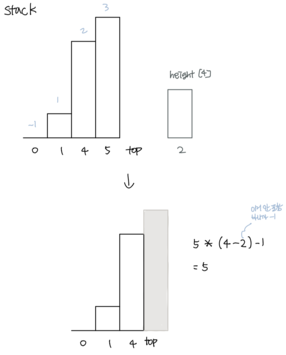
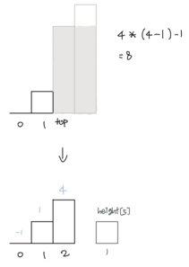
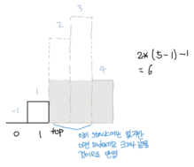

# 문제
- leetcode 문제이다.
```
Given n non-negative integers representing the histogram's bar height where the width of each bar is 1, find the area of largest rectangle in the histogram.
```

# 정리한 이유
- left, right pointer를 이용해서도 풀리지만 인풋이 많은 경우 시간 초과가 난다.
- stack을 이용해서 풀면 시간 초과없이 풀 수 있는데 전혀 stack을 사용할 수 있을 거라고 생각못했는데 사용했다.
- 정리하다보니 인덱스를 이런 식으로 축적해서 계산하다니 어메이징하다..

# 코드
- https://leetcode.com/problems/largest-rectangle-in-histogram/discuss/28917/AC-Python-clean-solution-using-stack-76ms
```
def largestRectangleArea(self, height):
    height.append(0)
    stack = [-1]
    ans = 0
    for i in range(len(height)):
        while height[i] < height[stack[-1]]:
            h = height[stack.pop()]
            # stack[-1]을 쓰는 이유는 지금까지의 인덱스를 축적하기 위해서.. 이런거 어떻게 생각하냐..
            w = i - stack[-1] - 1
            ans = max(ans, h * w)
        stack.append(i)
    height.pop()
    return ans
```
- 기본 원리는 stack에 있는 height를 항상 오름차순으로 유지하는 것이다.
- stack의 top보다 `height[i]`가 작다면 그렇지 않을 때까지 pop을 한다. 오름차순을 유지하기 위함이다.
- 이렇게 하면서 높이와 축적된 너비를 이용해 면적을 구한다.





# 주목할 점
- 문제를 풀 때 많이 고민한 부분은 개별 하나는 작지만 쭉 이어진게 클 수도 있고 하나가 무진장 클 수도 있는데 이걸 어떻게 효율적으로 아냐였다. 하지만 생각이 나지 않아 left, right 접근법을 썼고 시간초과에 걸리게 됐다 ㅠㅠ
- 그림에도 나오듯이 stack에 있는 index끼리 빼서 축적된 너비를 얻는 게 아니다. 앞에서부터 순차적으로 순회하면서 stack의 원소를 추가하는 동시에 작은 게 나오면 큰 걸 다 빼버리기 때문에 항상 마지막보다 한 칸 앞은 크거나 같다.