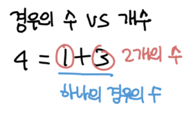

# 정리한 이유
- DP에 나름 여러 유형이 있는데 풀 때마다 좀 헷갈려서 정리했다.

# 공통
- 더 큰 경우의 수를 구하기 위해서는 더 작은 경우의 수를 구하면 된다.
- 예를 들면 `3`을 만들 수 있는 조합은 `(1, 1, 1), (1, 2), (3)`이 있다. 하지만 `(1, 1), (2)`는 `2`를 만들 수 있는 조합이다.

# 모든 경우의 수 구하기
- 경우의 수가 배열에 들어가면 된다.
- 아래 나오는 개수와 조금 다르다. `경우의 수`이므로 해당 경우를 포함했다고 1을 더하면 안 된다.
- 대표적으로는 특정 가치로 만드는 동전의 경우의 수가 있다. -> [동전 1 문제](https://www.acmicpc.net/problem/2293), [동전 1 해설](https://marades.tistory.com/5)

# 1차원에서 값의 max, min 구하기
- 값이 dp 배열에 들어가면 된다.
- 보통 여러 조합이 가능한데 그 중 max를 고르거나 min을 고르면 된다.
- 이때 그 값이 몇 원 같이 `가치`인 경우와 `개수`인 경우에 조금 다르게 처리해야 한다.
    - `가치`라면 그 조합의 가치를 모두 더했을 때의 max or min을 구하면 된다. -> [카드 구매하기 문제](https://www.acmicpc.net/problem/11052), [카드 구매하기 정리](https://github.com/zzozzolev/TIL/blob/master/CodintTest/%EB%B0%B1%EC%A4%80/silver1/DP/%EC%B9%B4%EB%93%9C%20%EA%B5%AC%EB%A9%94%ED%95%98%EA%B8%B0.md)
    - `개수`라면 해당 케이스는 이미 포함됐으니 `(해당 케이스를 넣었을 때 가능한 조합) + 1`을 하면 된다. -> [동전 2 문제](https://www.acmicpc.net/problem/2294), [동전 2 정리](https://github.com/zzozzolev/TIL/blob/master/CodintTest/%EB%B0%B1%EC%A4%80/silver1/DP/%EB%8F%99%EC%A0%84%202.md)

# 2차원에서 값의 max, min 구하기
- 2차원 배열이 주어진다. 아니면 문제 조건 보고 추측해야될 수도 있다.
- 보통 최대값을 구하는 게 많은 것 같다.
- 최댓값을 구하기 위해서는 이전 값이 필요하다. 이때 이 범위는 제한돼있다.
- 2차원이라고 BFS랑 헷갈리면 안 된다.
- 대표적으로 LCS가 있고 비슷하게 최대값을 구하는 문제도 있다. 
    - [LCS 문제](https://www.acmicpc.net/problem/9251), [LCS 해설](https://suri78.tistory.com/11)
    - [이동하기 문제](https://www.acmicpc.net/problem/11048), [이동하기 해설](https://github.com/zzozzolev/TIL/blob/master/CodintTest/%EB%B0%B1%EC%A4%80/silver1/DP/%EC%9D%B4%EB%8F%99%ED%95%98%EA%B8%B0.md)

# 2차원에서 경우의 수 나누고 이전 케이스 이용하기
- 보통 이럴 때는 뭐가 되고 안 되는지 케이스가 분명하게 정해져있고 한정돼있다.
- 이전의 케이스가 현재 케이스에 영향을 끼친다.
- 예를 들면 이전에 이렇게 배치했으면 다음에는 어떻게 배치해야된다든지 조건이 있다. -> [동물원 문제](https://www.acmicpc.net/problem/1309), [동물원 해설](https://sihyungyou.github.io/baekjoon-1309/)
- 특정한 조건이 있고 가능한 레인지가 있다. -> [기타리스트](https://www.acmicpc.net/problem/1495), [기타리스트 해설](https://m.blog.naver.com/PostView.nhn?blogId=occidere&logNo=221078781781&proxyReferer=https:%2F%2Fwww.google.com%2F)

# 3차원으로 DP 배열 만들기
- 변수가 3개가 있다.
- 문제에서 변수가 몇 개가 주어지는지 잘 봐야겠다.
- [자두나무 문제](https://www.acmicpc.net/problem/2240), [자두나무 해설](https://mygumi.tistory.com/140)

# 재귀 이용하기
- 현재 상태에 따라 결과값이 달라진다. 
- 갈 수 있는 상태가 여러가지이다. DP 배열 자체만 달라지는 게 아니라 인풋 자체가 달라질 수 있다.
- [카드게임](https://www.acmicpc.net/problem/10835), [카드게임 해설](https://fenslett.tistory.com/entry/%EB%B0%B1%EC%A4%80-10835-%EC%B9%B4%EB%93%9C-%EA%B2%8C%EC%9E%84?category=301370)