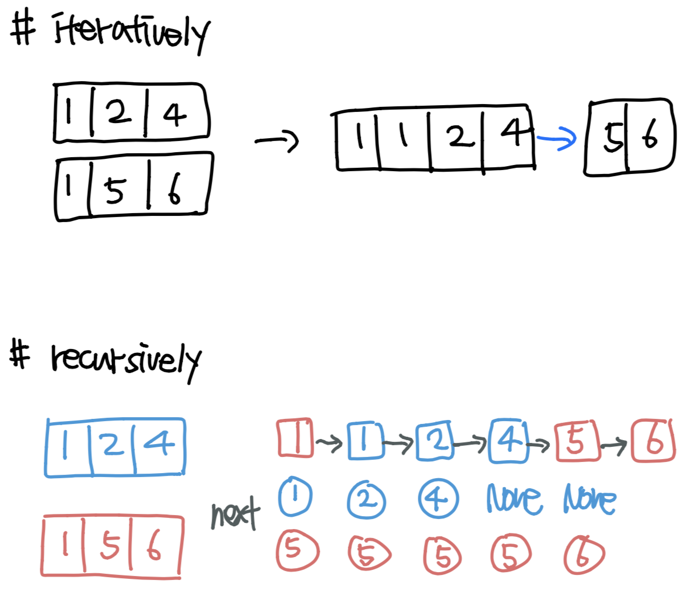

### 소모 시간
- 19분 14초

### 통과 여부
- 100%

### 문제점
- `root`, `cur`을 `None`으로 설정하기보다는 dummy를 만들어서 마지막에 `root.next`를 반환하면 된다.

### my solution
```
class Solution:
    def mergeTwoLists(self, l1: ListNode, l2: ListNode) -> ListNode:
        l1_pointer, l2_pointer = l1, l2
        
        root, cur = None, None
        while l1_pointer is not None and l2_pointer is not None:
            if l1_pointer.val <= l2_pointer.val:
                next_node = l1_pointer
                l1_pointer = l1_pointer.next
            else:
                next_node = l2_pointer
                l2_pointer = l2_pointer.next
            
            if root is None:
                root = next_node
                cur = next_node
            else:
                cur.next = next_node
                cur = next_node
        
        while l1_pointer is not None:
            if root is None:
                root = l1_pointer
                cur = l1_pointer
            else:
                cur.next = l1_pointer
                cur = l1_pointer
            l1_pointer = l1_pointer.next
        
        while l2_pointer is not None:
            if root is None:
                root = l2_pointer
                cur = l2_pointer
            else:
                cur.next = l2_pointer
                cur = l2_pointer
            l2_pointer = l2_pointer.next
        
        return root
```

### other solution
- 출처: https://leetcode.com/problems/merge-two-sorted-lists/discuss/9735/Python-solutions-(iteratively-recursively-iteratively-in-place).
```
# iteratively
def mergeTwoLists1(self, l1, l2):
    dummy = cur = ListNode(0)
    while l1 and l2:
        if l1.val < l2.val:
            cur.next = l1
            l1 = l1.next
        else:
            cur.next = l2
            l2 = l2.next
        cur = cur.next
    cur.next = l1 or l2
    return dummy.next
    
# recursively    
def mergeTwoLists2(self, l1, l2):
    if not l1 or not l2:
        return l1 or l2
    if l1.val < l2.val:
        l1.next = self.mergeTwoLists(l1.next, l2)
        return l1
    else:
        l2.next = self.mergeTwoLists(l1, l2.next)
        return l2
        
# in-place, iteratively        
def mergeTwoLists(self, l1, l2):
    if None in (l1, l2):
        return l1 or l2
    dummy = cur = ListNode(0)
    dummy.next = l1
    while l1 and l2:
        if l1.val < l2.val:
            l1 = l1.next
        else:
            nxt = cur.next
            cur.next = l2
            tmp = l2.next
            l2.next = nxt
            l2 = tmp
        cur = cur.next
    cur.next = l1 or l2
    return dummy.next
```
