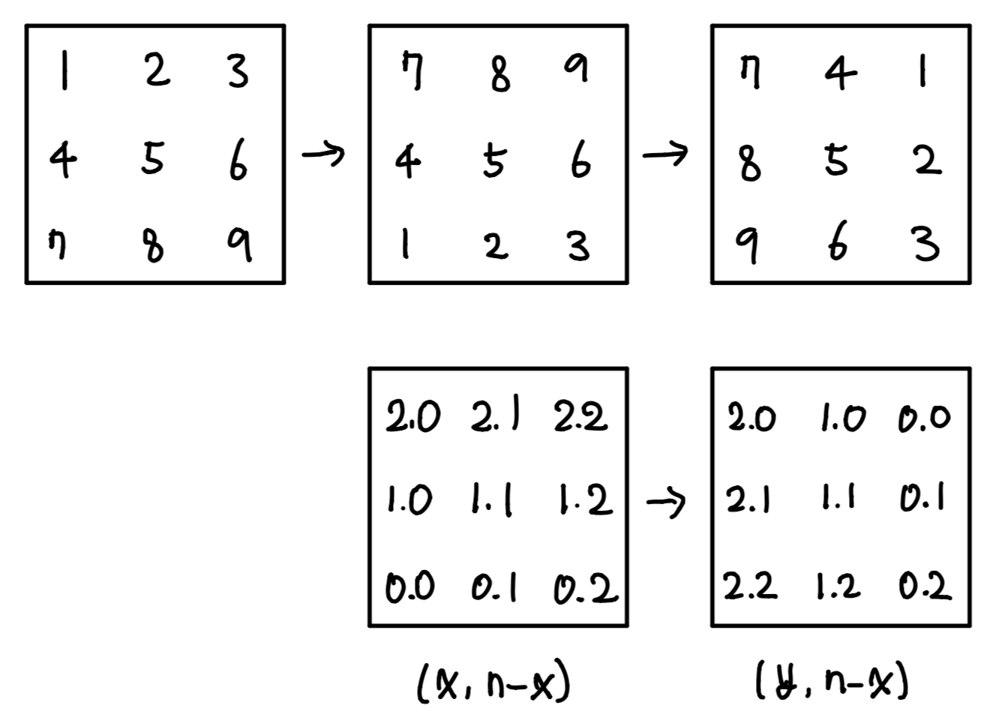

### 소모 시간
- 13분 25초

### 통과 여부
- 100%

### 접근법
- `(x, y)`가 회전 후 `(y, len(matrix)-1 - x)`로 바뀌는 것을 이용한다.
- `matrix`를 이중 for문으로 row와 column을 순회하면서 바뀌는 위치와 값을 튜플로 리스트에 추가해준다.
- 리스트를 순회하면서 `matrix`의 값을 바꿔준다.

### 문제점
- 불필요한 for문을 한 번 더 사용했다. 한 번에 x, y 좌표를 한 번에 변환시키지 않고 하나씩 했다면 굳이 필요 없었다.
- 좌표 변환이 여러 개 있을 때는 하나씩 하는 방법도 생각해보자. 

### my solution
```
class Solution:
    def rotate(self, matrix: List[List[int]]) -> None:
        """
        Do not return anything, modify matrix in-place instead.
        """
        # new (x, y, val)
        cache = []
        max_index = len(matrix) - 1
        for i in range(len(matrix)):
            for j in range(len(matrix)):
                cache.append( (j, max_index-i, matrix[i][j]) )
        
        for x, y, val in cache:
            matrix[x][y] = val
```

### other solution
- 출처: https://leetcode.com/problems/rotate-image/discuss/18884/Seven-Short-Solutions-(1-to-7-lines)
```
class Solution:
    def rotate(self, A):
        A[:] = zip(*A[::-1])
```
