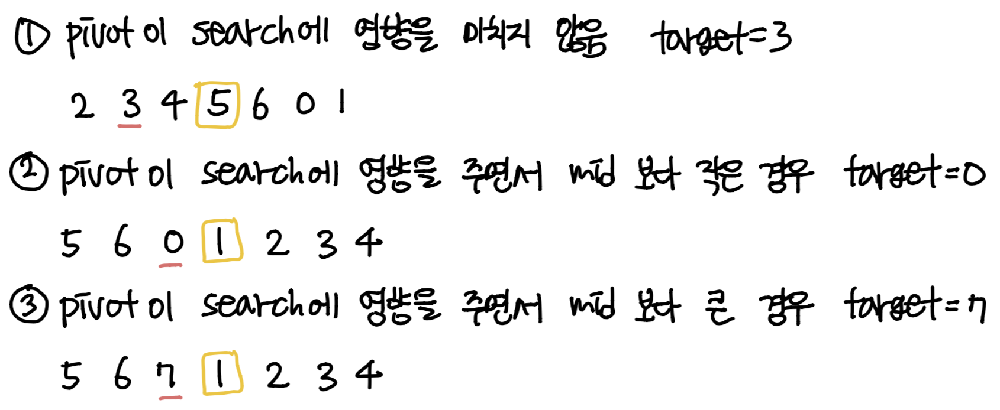

### 소모 시간
- 3분

### 통과율
- 100% 

### my solution
- 그냥 index 이용한 게 다이다.

### other solution
- 출처: https://leetcode.com/problems/search-in-rotated-sorted-array/discuss/14419/Pretty-short-C%2B%2BJavaRubyPython
```
class Solution(object):
   def search(self, nums, target):
       lo, hi = 0, len(nums) - 1
       while lo <= hi:
           mid = (lo+hi) // 2
           if nums[mid] == target:
               return mid
           if nums[0] <= target < nums[mid] or target < nums[mid] < nums[0] or nums[mid] < nums[0] <= target:
               hi = mid - 1
           else:
               lo = mid + 1

       return -1
```
