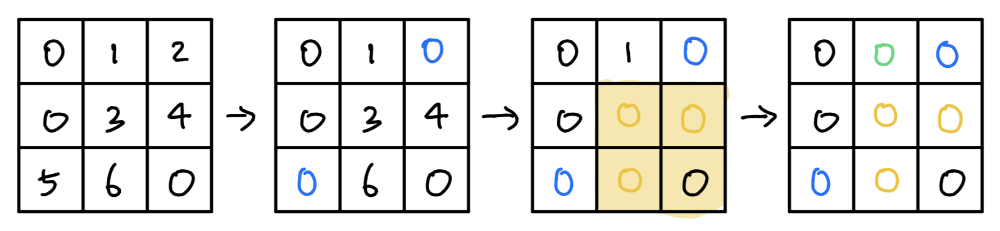

### 소모 시간
- 12분 15초

### 통과 여부
- 100%

### 접근법
- `matrix`를 순회하면서 element가 0인 경우 row과 col을 각각 list에 저장한다. 단, 이미 있다면 저장하지 않는다.
- 위에서 얻은 row와 col들을 각각 순회하면서 해당 row 혹은 col 전체를 0으로 만든다.

### 문제점
- 추가적인 리스트를 쓰지 않아도 충분히 가능하다.

### my solution
```
class Solution:
    def setZeroes(self, matrix: List[List[int]]) -> None:
        """
        Do not return anything, modify matrix in-place instead.
        """
        rows, cols = [], []
        for i in range(len(matrix)):
            for j in range(len(matrix[i])):
                if matrix[i][j] == 0:
                    if i not in rows:
                        rows.append(i)
                    if j not in cols:
                        cols.append(j)
        
        for row in rows:
            matrix[row] = [0] * len(matrix[row])
        
        for col in cols:
            for i in range(len(matrix)):
                matrix[i][col] = 0
```

### other solution
- https://leetcode.com/problems/set-matrix-zeroes/discuss/26115/JavaPython-O(1)-space-11-lines-solution comment
```
class Solution:
    def setZeroes(self, matrix: List[List[int]]) -> None:
        if not matrix or not matrix[0]:
            return
        
        m, n = len(matrix), len(matrix[0])
        first_row_has_zero = not all(matrix[0])
        first_col_has_zero = False
        
        for row in matrix:
            if row[0] == 0:
                first_col_has_zero = True
                break
        
        for row in range(1, m):
            for col in range(1, n):
                if matrix[row][col] == 0:
                    matrix[0][col] = matrix[row][0] = 0
                    
        for row in range(1, m):
            for col in range(1, n):
                if matrix[0][col] == 0 or matrix[row][0] == 0:
                    matrix[row][col] = 0
                    
        if first_row_has_zero:
            matrix[0] = [0] * n
        
        if first_col_has_zero:
            for row in matrix:
                row[0] = 0
```
