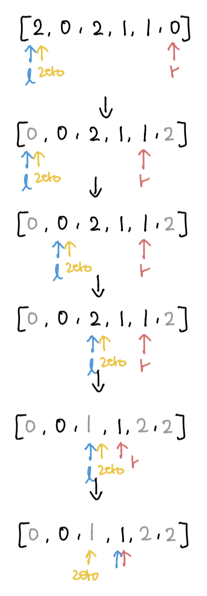

### 소모 시간
- 9분 19초

### 통과율
- 100%

### 접근법
- `nums`의 엘리먼트 개수를 세고 0부터 2까지 순회하면서 `nums[반복문 시작 지점:시작 지점 + 카운트 개수]`를 해당 num으로 바꾼다. 
- 시작 지점은 0으로 초기화하고 한 번의 iter가 끝날 때마다 카운트를 더해준다.

### my solution
```
from collections import Counter
class Solution:
    def sortColors(self, nums: List[int]) -> None:
        """
        Do not return anything, modify nums in-place instead.
        """
        d = dict(Counter(nums))
        start_idx = 0
        for i in range(3):
            if i not in d:
                continue
            nums[start_idx:start_idx+d[i]] = [i] * d[i]
            start_idx += d[i]
```

### other solution
- https://leetcode.com/problems/sort-colors/discuss/26706/Python-count-sort-and-one-pass-sort.
```
# one pass 
def sortColors(self, nums):
    # zero and r record the position of "0" and "2" respectively
    l, r, zero = 0, len(nums)-1, 0
    while l <= r:
        if nums[l] == 0:
            nums[l], nums[zero] = nums[zero], nums[l]
            l += 1; zero += 1
        elif nums[l] == 2:
            nums[l], nums[r] = nums[r], nums[l]
            r -= 1
        else:
            l += 1
```
