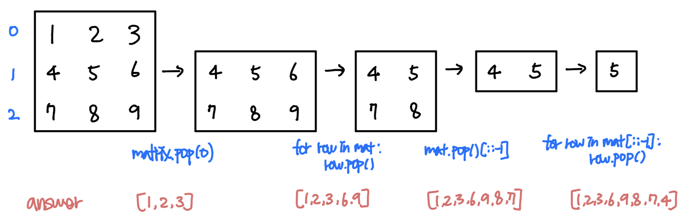

### 소모 시간
- 32분 27초

### 통과 여부
- 100%

### 접근법
- 나선형으로 움직이기 위해 right, down, left, up으로 반복해서 움직이는 패턴을 이용한다.
- matrix의 전체 합보다 정답의 합이 작을 때 까지 나선형의 움직임 패턴을 반복한다.
    - 각각의 움직임에서는 시작 row index와 시작 col index를 기준으로 for문을 이용해 각각의 움직임에 맞게 row 혹은 col의 index를 더하거나 뺀다.
    - 만약 이미 answer에 들어있다면 for문을 멈추고 마지막 row, col을 반환한다.
    - 시작 row와 col을 위에서 반환한 row와 col로 업데이트한다.

### 문제점
- 다른 해결법처럼 기존의 matrix의 row나 col을 제거하지 않고 단순히 순회를 하기 때문에 시작 지점을 계속 업데이트하고 있는지 없는지 체크를 해야한다.

### my solution
```
class Solution:
    def spiralOrder(self, matrix: List[List[int]]) -> List[int]:
        flat = [col for row in matrix for col in row]
        answer = []
        # update start_row and start_col
        start_row, start_col = 0, -1
        while sum(flat) > sum(answer):
            start_row, start_col = self.move_right(matrix, answer, start_row, start_col)
            start_row, start_col = self.move_down(matrix, answer, start_row, start_col)
            start_row, start_col = self.move_left(matrix, answer, start_row, start_col)
            start_row, start_col = self.move_up(matrix, answer, start_row, start_col)
        
        return answer
    
    def move_right(self, matrix, answer, start_row, start_col):
        row, col = start_row, start_col
        for j in range(1, len(matrix[start_row])-start_col):
            if matrix[start_row][start_col+j] in answer:
                col = start_col + j - 1
                break
            else:
                answer.append(matrix[start_row][start_col+j])
        
        if col == start_col:
            col = len(matrix[start_row]) - 1
        
        return row, col
            
    
    def move_down(self, matrix, answer, start_row, start_col):
        row, col = start_row, start_col
        for i in range(1, len(matrix)-start_row):
            if matrix[start_row+i][start_col] in answer:
                row = start_row + i - 1
                break
            else:
                answer.append(matrix[start_row+i][start_col])
        
        if row == start_row:
            row = len(matrix) - 1
        
        return row, col
        
    def move_left(self, matrix, answer, start_row, start_col):
        row, col = start_row, start_col
        for j in range(1, start_col+1):
            if matrix[start_row][start_col-j] in answer:
                col = start_col - j + 1
                break
            else:
                answer.append(matrix[start_row][start_col-j])
        
        if col == start_col:
            col = 0
        
        return row, col
    
    def move_up(self, matrix, answer, start_row, start_col):
        row, col = start_row, start_col
        for i in range(1, start_row+1):
            if matrix[start_row-i][start_col] in answer:
                row = start_row - i + 1
                break
            else:
                answer.append(matrix[start_row-i][start_col])
        return row, col
```

### other solution
- 출처: https://leetcode.com/problems/spiral-matrix/discuss/20821/An-iterative-Python-solution
```
class Solution:
    def spiralOrder(self, matrix):
        result = []
        
        while matrix and matrix[0]:
            if matrix[0]:
                result += matrix.pop(0)
            
            if matrix and matrix[0]:
                for row in matrix:
                    result.append(row.pop())
            
            if matrix and matrix[-1]:
                result += matrix.pop()[::-1]

            if matrix and matrix[0]:
                for row in matrix[::-1]:
                    result.append(row.pop(0))
        
        return result
```

