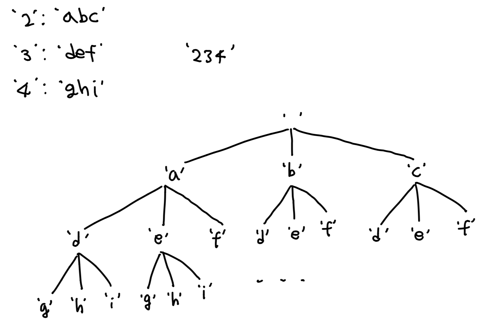

### 소모 시간
- 19분

### 통과 여부
- 100%

### 문제점
- 조합을 사용해 속도가 느려지고 불필요한 값을 걸러내야했다.

### my solution
```
from itertools import combinations

class Solution:
    def letterCombinations(self, digits: str) -> List[str]:
        if len(digits) == 0:
            return []
        
        mapping = {
            "2": ["a", "b", "c"],
            "3": ["d", "e", "f"],
            "4": ["g", "h", "i"],
            "5": ["j", "k", "l"],
            "6": ["m", "n", "o"],
            "7": ["p", "q", "r", "s"],
            "8": ["t", "u", "v"],
            "9": ["w", "x", "y", "z"]
        }
        answer = set()
        selected = []
        for ch in digits:
            selected.extend([(ch, e) for e in mapping[ch]])
        
        combs = combinations(selected, len(digits))
        for comb in combs:
            ch_kinds, chars = [], ""
            for p in comb:
                ch_kinds.append(p[0])
                chars = chars + p[1]
            if list(sorted(ch_kinds)) == list(sorted(list(digits))):
                answer.add(chars)
                
        return list(answer)
```

### other solution
```
def letterCombinations(self, digits):
    dict = {'2':"abc", '3':"def", '4':"ghi", '5':"jkl", '6':"mno", '7': "pqrs", 
        '8':"tuv", '9':"wxyz"}
    cmb = [''] if digits else []
    for d in digits:
        cmb = [p + q for p in cmb for q in dict[d]]
    return cmb
```
