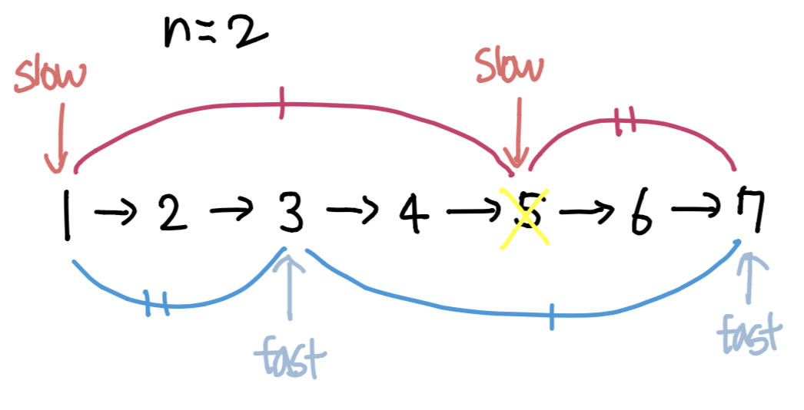

### 소모 시간
- 15분

### 통과 여부
- 100%

### 문제점
- single node 처리를 안 해줬다. leetcode는 이런 처리가 필수인 것 같다.
- `while node.next != None`으로 조건을 줘서 마지막 노드가 반영되지 않았다.
- head가 제거될 때를 처리하지 않아 이 부분에서 막혔는데 head가 아닌 걸 제거하는 부분이랑 꼬여서 애를 좀 먹었다.

### my solution
```
# Definition for singly-linked list.
# class ListNode:
#     def __init__(self, val=0, next=None):
#         self.val = val
#         self.next = next
class Solution:
    def removeNthFromEnd(self, head: ListNode, n: int) -> ListNode:
        node = head
        
        if node.next == None:
            return None
        
        cache = {}
        idx = 0
        
        while node != None:
            cache[idx] = node
            node = node.next
            idx += 1
        
        n_from_head = idx - n
        # head
        if n_from_head == 0:
            head = head.next
        else:    
            prev_node = cache[n_from_head-1]
            removed_node = cache[n_from_head]
            prev_node.next = removed_node.next
        
        return head
```

### other solution
- 출처: https://leetcode.com/problems/remove-nth-node-from-end-of-list/discuss/8802/3-short-Python-solutions
```
class Solution:
    def removeNthFromEnd(self, head, n):
        fast = slow = head
        for _ in range(n):
            fast = fast.next
        if not fast:
            return head.next
        while fast.next:
            fast = fast.next
            slow = slow.next
        slow.next = slow.next.next
        return head
```
