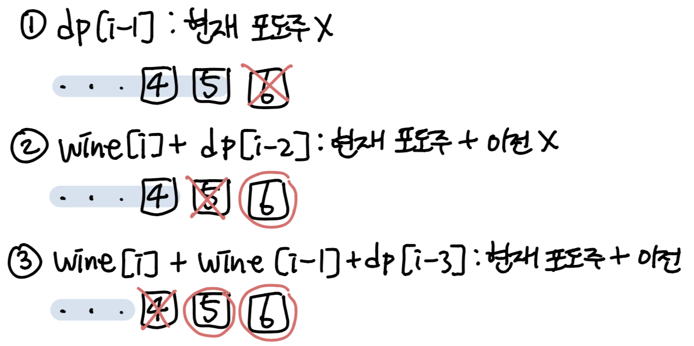

### 소모 시간
- 56분 50초

### 통과 여부
- non-pass (틀렸습니다)
- 예제는 돌아갔는데 전체 테케에서 틀림...

### 문제점
- 3가지 케이스에 대해서 생각은 했는데 그걸 점화식으로 표현을 못했다.
- window를 이용하는 게 아니라 index를 이용하는 거다.

### my solution
```
def main():
    n = int(input())
    wines = [int(input()) for _ in range(n)]
    dp = [ [ [wines[0]+wines[1], (0,1)] , [wines[0]+wines[2], (0, 2)], [wines[1]+wines[2], (1,2)] ] ]
    combis = [(0,1), (0,2), (1,2)]

    for i in range(3, len(wines), 3):
        windows = wines[i:i+3]
        tmp = []
        for quan, indice in dp[-1]:
            if indice == (1, 2) and len(windows) > 3:
                tmp.append( [quan+windows[1]+windows[2], (1,2)] )
            else:
                if indice == (0, 1):
                    cand = [ [quan+windows[pair[0]]+windows[pair[1]], pair] for pair in combis]
                elif indice == (0, 2) and len(windows) > 3:
                    cand = [ [quan+windows[pair[0]]+windows[pair[1]], pair] for pair in combis[1:]]
                
                cand.sort(reverse=True)
                tmp.append(cand[0])
        dp.append(tmp)

    print(max([quan for quan, indice in dp[-1]]))    

if __name__ == "__main__":
    main()
```

### other solution
- https://wootool.tistory.com/94

