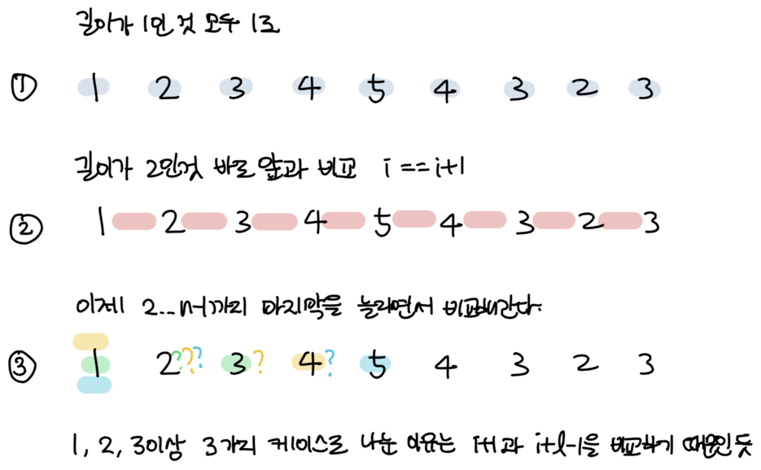

### 소모 시간
- 32분 13초

### 통과 여부
- non-pass (시간 초과)

### 문제점
- 질문 수(`M`)가 너무 많아서 캐쉬를 이용하려고 했다. 원래는 내부에서 이미 펠린드롬인게 나왔으면 내부 펠린트롬을 제외한 나머지만 보는 식으로 하려고 했는데 범위가 일부만 겹쳐있으면 작동하지 않는 것 같아 이미 정답에 있으면 캐쉬를 사용하는 식으로 했는데 그래도 시간 초과가 난 것 같다.
- 조금만 더 생각했으면 DP문제에 맞게 풀었을텐데..

### my solution
```
def main():
    n = int(input())
    a = list( map(int, input().split()) )
    m = int(input())
    
    # (start, end): True or False
    cache = {}
    answer = []
    for _ in range(m):
        # start: 포함, end: 안 포함
        start, end = list( map(int, input().split()) )
        start -= 1
        end -= 1
        
        if (start, end) in cache:
            answer.append("1")
        
        else:
            if start == end:
                s1 = ""
                s2 = ""
            else:
                mid = (start + end) // 2
                if (end - start + 1) % 2 == 0:
                    s1 = a[start:mid+1]
                    s2 = a[end:mid:-1]
                else:
                    s1 = a[start:mid]
                    s2 = a[end:mid:-1]

            if s1 == s2:
                cache[(start, end)] = True
                answer.append("1")
            else:
                cache[(start, end)] = False
                answer.append("0")
    
    for ans in answer:
        print(ans)
    
if __name__ == "__main__":
    main()
```

### other solution
- 출처: https://copy-driven-dev.tistory.com/entry/%EB%B0%B1%EC%A4%80Python10942DP-%ED%8C%B0%EB%A6%B0%EB%93%9C%EB%A1%AC

