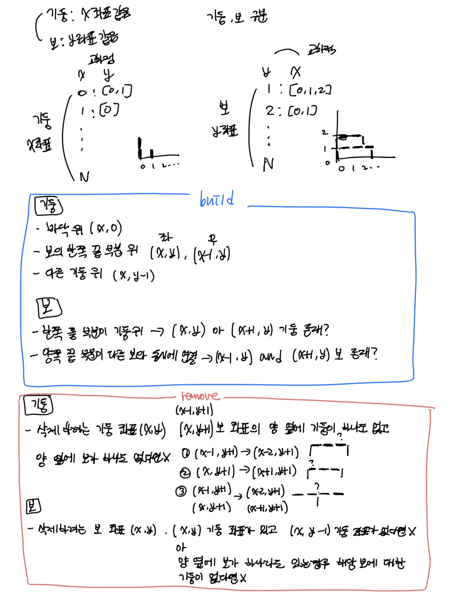

### 소요 시간
- 3시간..?

### 통과율
- 19.2% ...

### 접근법


### 문제점
- 조건이 까다로우면 생각 자체를 잘 못하는 것 같다.
- 자료 구조를 쓸데없이 헷갈리게 만들었다.
- 딱 인풋으로 들어온 것만 검사해서 틀린 것 같다. `answer` 자체를 검증할 생각을 못했다.

### my solution
```
from collections import defaultdict

def solution(n, build_frame):
    answer = []
    row_dic = defaultdict(list)
    col_dic = defaultdict(list)
    
    
    for e in build_frame:
        x, y = e[0], e[1]
        kind = e[2]
        job = e[3]
        
        # column
        if kind == 0:
            # remove
            if job == 0:
                if check_remove_col(x, y, row_dic, col_dic):
                    col_dic[x].remove(y)
            # build
            else:
                if check_build_col(x, y, row_dic, col_dic):
                    col_dic[x].append(y)
                     
        # row
        else:
            # remove
            if job == 0:
                if check_remove_row(x, y, row_dic, col_dic):
                    row_dic[y].remove(x)
            # build
            else:
                if check_build_row(x, y, row_dic, col_dic):
                    row_dic[y].append(x)
    
    col_values = get_values(col_dic, 0)
    row_values = get_values(row_dic, 1)
    
    answer = sorted(col_values + row_values, key = lambda x: (x[0], x[1], x[2]))
    
    return answer


def check_remove_col(x, y, row_dic, col_dic):
    if x-1 in row_dic[y+1] and x in row_dic[y+1]:
        if x-1 not in col_dic and x-2 not in row_dic[y+1]:
            return False
        if x+1 not in col_dic and x+1 not in row_dic[y+1]:
            return False
    
    elif x-1 in row_dic[y+1]:
        if x-1 not in col_dic and x-2 not in row_dic[y+1]:
            return False
    
    elif x in row_dic[y+1]:
        if x+1 not in col_dic and x+1 not in row_dic[y+1]:
            return False
    
    return True

def check_build_col(x, y, row_dic, col_dic):
    if y == 0:
        return True
    
    elif x in row_dic[y] or x-1 in row_dic[y]:
        return True
    
    elif y-1 in col_dic[x]:
        return True

    else:
        return False    
    
def check_build_row(x, y, row_dic, col_dic):
    if y-1 in col_dic[x] or y-1 in col_dic[x+1]:
        return True
    
    elif x-1 in row_dic[y] and x+1 in row_dic[y]:
        return True
    
    else:
        return False

def check_remove_row(x, y, row_dic, col_dic):
    if y in col_dic[x] and y-1 not in col_dic[x]:
        return False
    
    elif y-1 not in col_dic[x]:
        if x-1 in row_dic[y] and x+1 in row_dic[y]:
            if y-1 not in col_dic[x-1]:
                return False
            if y-1 not in col_dic[x+1]:
                return False
        
        elif x-1 in row_dic[y]:
            if y-1 not in col_dic[x-1]:
                return False
        
        elif x+1 in row_dic[y]:
            if y-1 not in col_dic[x+1]:
                return False

    else:
        return True

def get_values(kind_dic, kind):
    result = []
    for key, values in kind_dic.items():
        if kind == 0:
            result.extend([[key, e, 0] for e in values])
        else:
            result.extend([[e, key, 1] for e in values])
    return result
```

### other solution
- https://johnyejin.tistory.com/125
```
def check(ans):
    for x, y, what in ans:
        # 기둥
        # 1. 바닥 위에 있어야댐
        # 2. 보의 한쪽 끝 부분 위에 있어야댐
        # 3. 다른 기둥 위에 있어야댐
        if what == 0:
            if y == 0 or [x-1, y, 1] in ans or [x, y, 1] in ans or [x, y-1, 0] in ans:
                continue
            else:
                return False
        # 보
        # 1. 한쪽 끝 부분이 기둥 위에 있어야댐
        # 2. 양쪽 끝 부분이 다른 보와 동시에 연결
        elif what == 1:
            if [x, y-1, 0] in ans or [x+1, y-1, 0] in ans or ([x-1, y, 1] in ans and [x+1, y, 1] in ans):
                continue
            else:
                return False
    return True


def solution(n, build_frame):
    answer = []

    for f in build_frame:
        x, y, what, how = f

        if how == 1:  # 설치
            answer.append([x, y, what])
            if check(answer) is False:
                answer.remove([x, y, what])
        else:  # 삭제
            answer.remove([x, y, what])
            if check(answer) is False:
                answer.append([x, y, what])

    answer.sort()
    return answer
```