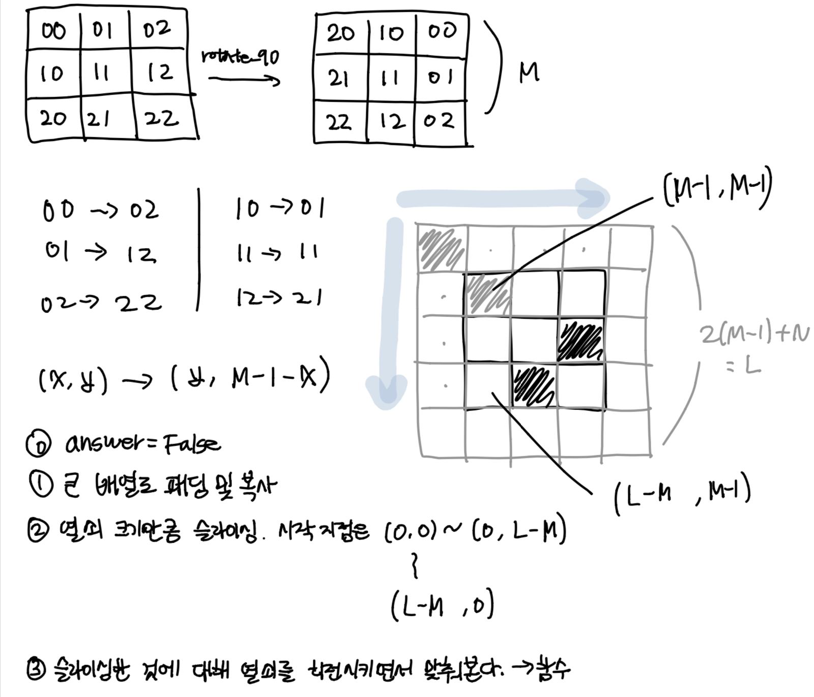

### 소요 시간
- 의미가 없음

### 통과율
- 73%

### 접근법


### 문제점
- 쓸데없이 복잡한 거 같다.
- rotate는 한 번씩만 해도 되는데 매번 해서 비효율적이다.
- 동시에 순회하는 두 배열의 인덱스를 이랬다 저랬다 해서 시간을 소모했다. -> 작은 거 기준으로 순회하고 큰 거는 시작 인덱스 정해서 거기에 더하는 게 깔끔한 듯. 예를 들면, 큰 거 시작 인덱스가 k 라고 하면 i, j를 작은 거 길이로 하고 k + i 이런 식으로

### my solution
```
import copy

def solution(key, lock):
    answer = False
    lock_extended = get_lock_extened(lock, len(key))
    end_plus_one = len(lock_extended) - len(key)

    for i in range(end_plus_one):
        for j in range(end_plus_one):
            copied = copy.deepcopy(key)
            fit_flag = is_fit(copied, i, j, lock_extended)
            if fit_flag:
                answer = True
                break
            for _ in range(3):
                rotated = rotate(key)
                fit_flag = is_fit(rotated, i, j, lock_extended)
                if fit_flag:
                    answer = True
                    break
                key = rotated

        if answer:
            return answer

    return answer


def get_lock_extened(lock, key_length):
    l = 2 * (key_length - 1) + len(lock)
    lock_extended = get_2d_list(l, l, -1)
    for i in range(key_length):
        for j in range(len(lock[0])):
            lock_extended[key_length - 1 + i][key_length - 1 + j] = lock[i][j]
    
    return lock_extended


def is_fit(key, row, col, lock_extended):
    fit_flag = True
    for i in range(len(key)):
        for j in range(len(key[0])):
            if lock_extended[row + i][col + j] == -1:
                continue
            
            if lock_extended[row + i][col + j] == 1 and key[i][j] == 1:
                fit_flag = False
                break
    
        if not fit_flag:
            break
    
    return fit_flag


def rotate(key):
    rotated = get_2d_list(len(key), len(key[0]))
    for i in range(len(key)):
        for j in range(len(key[0])):
            rotated[j][len(key) - 1 - i] = key[i][j]
    
    return rotated


def get_2d_list(row, col, pad_value=0):
    result = []
    for _ in range(row):
        result.append([pad_value] * col)
    
    return result
```


### other solution
- 출처: https://johnyejin.tistory.com/127
```
# 90도 회전
def rotation(arr):
    n = len(arr)
    ret = [[0] * n for _ in range(n)]

    for i in range(n):
        for j in range(n):
            ret[j][n-1-i] = arr[i][j]
    return ret

# 자물쇠가 열리는지 췍
def check(startX, startY, key, lock, expendSize, start, end):
    expendList = [[0] * expendSize for _ in range(expendSize)]

    # expendList에 key 추가
    for i in range(len(key)):
        for j in range(len(key)):
            expendList[startX + i][startY + j] += key[i][j]

    # expendList에 lock 추가하면서 기존 값이랑 더하기
    for i in range(start, end):
        for j in range(start, end):
            # i, j는 start부터 시작하니 1씩 증가
            expendList[i][j] += lock[i - start][j - start]
            if expendList[i][j] != 1:
                return False

    return True

def solution(key, lock):
    start = len(key) - 1  # expendList에서 lock의 시작 지점
    end = start + len(lock)  # expendList에서 lock이 끝나는 지점
    expendSize = len(lock) + start * 2  # expendList 배열의 크기

    # lock은 고정이고 key가 움직이는거!!!
    for a in range(0, 4):
        for i in range(end):
            for j in range(end):
                if check(i, j, key, lock, expendSize, start, end):
                    return True
        key = rotation(key)

    return False
```