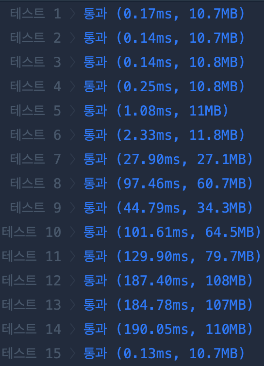
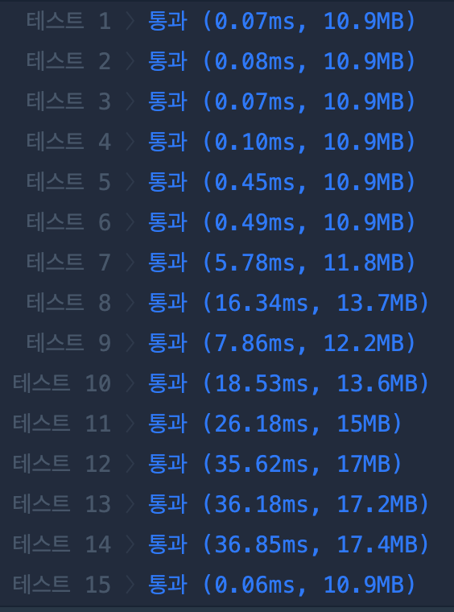

### 소모 시간
- 23분

### 통과율
- 100%

### 접근법
- `s`의 `{`를 `[`로 바꾸고 `]`를 `}`로 바꾼 뒤, `eval`로 이차원 리스트를 얻는다.
- 이차원 리스트를 길이 순으로 정렬한다.
- `answer`를 이차원 리스트의 길이 만큼 -1로 초기화한다.
- 정렬된 이차원 리스트를 순회하면서 인덱스 `i`를 1씩 증가시키면서 다음의 작업을 반복한다.
- `answer`의 `i`까지는 이미 확정된 원소임을 이용해 이차원 리스트의 해당 원소 set에서 확정된 원소 set을 뺀 후, 차이가 나는 원소를 `answer`의 `i`번째로 추가한다. ex) list elem: [3, 4, 5], fixed: [4, 5] -> set(list elem) - set(fixed) = {3} -> append 3 to `answer[2]`

### 문제점
- `re`와 `eval`을 사용해 속도가 아주 느렸다.
- `re`와 `eval` 사용했을 때 속도

- `split` 사용했을 때 속도


### my solution
```
import re

def solution(s):
    left_replaced = re.sub("{", "[", s)
    replaced = re.sub("}", "]", left_replaced)
    lst = eval(replaced)
    
    sorted_lst = sorted(lst, key = lambda x: len(x)) 
    # init tuple
    answer = [-1] * len(sorted_lst)
    
    # sort by len and iter loop
    for i, e in enumerate(sorted_lst):
        if i == 0:
            answer[0] = e[0]
        else:
            fixed = answer[:i]
            diff = set(e).difference(set(fixed))
            answer[i] = diff.pop()
    
    return answer
```

### other solution
- 출처: https://covenant.tistory.com/157
```
def solution(S):
    S = S[2:-2].split("},{")
    numArr = []
    for i in range(len(S)):
        s = S[i].split(",")
        numArr.append(set(s))
 
    numArr.sort(key=lambda x: len(x))
 
    ans = set()
    res = []
    for a in numArr:
        tmp = a - ans
        res.append(list(tmp)[0])
        ans = ans | tmp
 
    res = [int(i) for i in res]
    return res
```