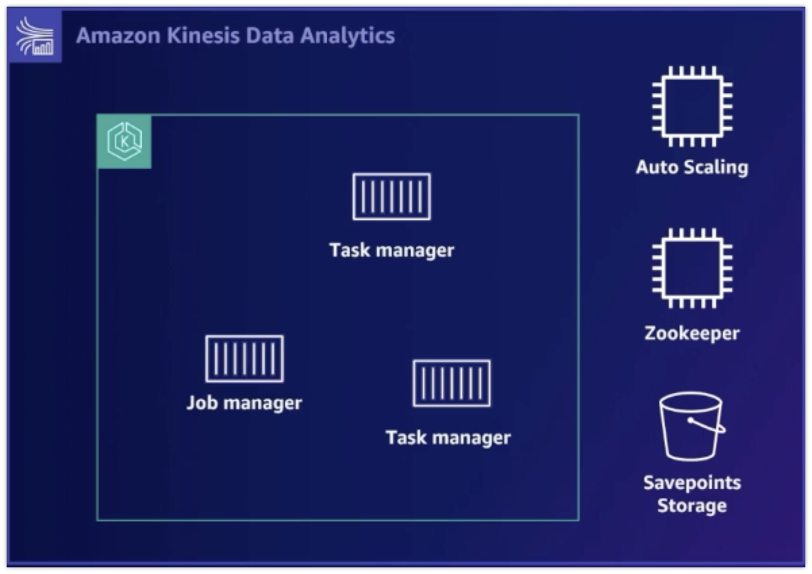

## 일체형 데이터베이스, 목적에 맞게 MSA 구조로 전환하기
### 모던 애플리케이션과 마이크로 서비스 아키텍처
- 모던 애플리케이션
  - 여러 지역의 유저가 사용해 요청량이 많지만 밀리초 내에 빠르게 서빙될 수 있어야한다.
  - 정합성이 있으면서 빠른 개발과 배포를 요구한다.
- 마이크로 서비스 아키텍처
  - 모놀리틱 시스템을 서비스 단위로 분리
  - 더 빠르게 개발 및 배포하면서도 서비스 간 영향을 줄인다.
- 마이크로 서비스의 시작은 적절한 DB를 선택하는 것부터 시작된다.  
- 모놀리틱 RDB 한계
  - 성능 이슈
  - 확장성 한계
  - 개발자들의 유연성 저해
  - 통합할 수 없는 데이터 타입
- 각각의 DB 별로 효과적으로 처리할 수 있는 데이터가 있고 그렇지 않은 데이터가 있다.
- 조인을 쓰지 않게 되면 DB의 부하도 줄어들게 된다.

### 목적별 데이터 베이스
- relational -> Aurora, RDS
  - 트랜잭션
  - Lift-and-shift(그대로 옮기기), ERP(Enterprise Resource Planning), CRM(Customer Relationship Management), finance
- key-value: DynamoDB
  - NoSQL이지만 보조 인덱스 및 ACID 트랜잭션 제공
  - 실시간 입찰/거래, 장바구니, SNS, 상품 카탈로그, 고객 선호도
- Document: DocumentDB
  - 스키마리스 DB
  - 초당 수백만 요청량 처리 가능
  - 밀리 세컨드 수준의 응답 시간 보장
  - 컨텐츠 관리, 개인화, 모바일
- In-Memory: Elastic Cache
  - 마이크로 세건드 수준의 응답 시간 보장
  - 리더보드(레디스 sorted set), 실시간 분석, 캐싱
- Graph: Neptune
  - 사기탐지, 소셜 네트워킹, 추천 엔진
- Time-series: TimeStream
  - IoT 응용프로그램, 이벤트 추적
- Ledger: QLDB
  - 변조 방지
  - 모든 변경 이력을 체이닝 방식으로 관리
  - 원장(거래 기록 장부) 기록, 공급망, 헬스 케어, 금융
- Wide Column: Keyspaces
  - 낮은 응답 시간 응용 프로그램, 클라우드에서 카산드라 사용

### 핸즈온랩
- AWS DMS를 이용하면 디비 간의 마이그레이션을 더 쉽게 할 수 있다.

## 데이터 분석 실시간으로 처리하기: Kinesis Data Streams vs MSK

### Kinesis Data Stream과 MSK의 3가지 특징
- Queue
- Distributed
- Storage

#### Queue
- FIFO: 데이터가 입력된 순서대로 처리되도록 보장한다.
- 하지만 입력이 몰리면 스케일을 늘려야한다.

#### Distributed
- 입력이 몰렸을 때의 대응 방법으로 scale-out을 선택해 얻게 된 특성이다.
- 동일한 큐를 내부적으로 여러 개 가지고 있다.
- 이런 동일 큐를 샤드 혹은 파티션이라고 부른다.
- 여러 개의 파티션이 있으면 프로듀서로부터 오는 데이터를 어떻게 분배할지 정하는 분배전략이 필요하다.
- 컨슈머가 파티션 키를 보내주면 해쉬 함수를 이용해 각 파티션을 분배한다.
- 외부에서는 여러 개의 파티션이 있어도 하나의 큐로, 여러 컨슈머가 있어도 하나의 컨슈머처럼 보인다.

#### Storage
- 어떤 컨슈머가 데이터를 읽더라도 데이터를 삭제하지 않고 남겨둔다.
- 그 다음 읽어갈 위치인 offset만 기록한다.
- 그래서 특정 인덱스 부터 혹은 처음부터 데이터를 읽을 수 있게 된다.
- 하지만 일반적인 스토리지와 달리 데이터를 얼마나 오랫동안 보관할지 지정하는 `리텐션`이 존재한다.
- 리텐션 기간이 지난 데이터를 오래된 순서부터 자동으로 삭제한다.

### 스트림 스토리지 도입 효과
- 프로듀서와 컨슈머의 분리
  - 프로듀서의 생산 속도와 컨슈머의 소비 속도를 맞추지 않아도 괜찮다.
- persistent 버퍼
- 다수의 스트림을 수집
  - 컨슈머가 프로듀서에 직접 연결하지 않기 때문에 메쉬한 형태로 만들기 않고 구조를 단순화한다.
- 메세지 순서 유지
  - 프로듀서가 생산한 순서대로 컨슈머가 데이터를 소비할 수 있게 만들어준다.
  - 단, 단일 파티션내에서만 순서를 보장하고 전체 파티션간의 순서를 보장하지는 않는걸 주의해야한다.
- 병렬적인 소비
  - 컨슈머들이 서로 다른 샤드나 파티션에서 개별적으로 동시에 데이터를 읽을 수 있다.
- 스트리밍 맵리듀스
  - 파티션 키를 기준으로 입력 데이터들이 그룹핑돼 서로 다른 파티션에 저장된다.
  - 여러 컨슈머들이 그룹핑된 데이터를 동시에 소비할 수 있다.

### MSK vs Kinesis
#### MSK
- 단일 클러스터? 다수 클러스터?
- 클러스터 별 브로커 수?
- 브로커 별 토픽 수?
- 토픽별 파티션 개수?
- 성능을 올리고 싶을 때 브로커를 추가함: Cluster 프로비저닝 모델
- 토픽의 파티션 수는 줄일 수 있지만 감소는 안 됨.
- 일부 AWS 서비스와 통합: Glue, Lambda, Kinesis Data Analytics

#### Kinesis
- 클러스터와 브로커 개념 없음.
- 스트림(토픽) 개수?
- Throughput 프로비저닝 모델
- 샤드 수의 증가와 감소 모두 가능함.
- 대부분의 AWS 서비스와 완전 통합.

### 새로 나온 것
- Kinesis Data Streams On-Demand: 데이터 양에 따라 샤드를 자동으로 조정.

## Mass Data 통합과 실시간 분석으로 살펴보는 삼성전자의 분석 현대화 여정
- 삼성 전자 빅데이터 플랫폼에서 최초로 AWS Lake Formation을 실제 서비스에 도입.
- 레이크 하우스는 권한 관리가 어려움.

### AWS Lake Formation
- 데이터베이스 방식의 세밀한 권한 관리
- 카탈로그 리소스에 대한 세밀한 권한 설정
- 특정 리소스에 대한 권한으로 S3 접근 제어
- 확장을 위한 LF-TAG 기반의접근 제어
- 다른 서비스, 도구와의 통합성
- 권한과 접근에 대한 쉬운 감사

### 특별한 점
- SSO 기반 유저 관리
- 민감 정보 Masking
- **손쉬운 레이크하우스 환경 구성**
  - 공유/권한 부여가 Lake formation으로 통일돼 관리 과정이 일원화

### 아쉬운 점
- 카탈로그 수준 공유 기능
  - 현재는 데이터 베이스 수준의 공유만 가능하다.
- TAG 기반 데이터 공유
  - 공유된 테이블에서 SAML 그룹으로 권한 부여시 테이블 수준으로만 설정 가능하다.
- FEDERATED QUERY의 공유 기능
  - MySQL, Hive 등 SQL 엔진의 경우 직접 데이터를 복사해야한다.

> 아래부터는 삼성 전자 SmartThings 부서

### 스파크 운영 고통 요소
- EC2 기반 스파크의 기능 제약
  - 소규모 일괄 처리로 인한 스트리밍 데이터 처리 지연
  - 잦은 애플리케이션 부하 증가 알림
  - 장애 처리를 위한 빈번한 온콜

### Amazon Kinesis Data Analytics(KDA) 활용

- 클러스터 운영에 많이 소요됐던 작업을 많이 덜어줬다.
- EKS 기반 플링크 클러스터를 제공하는 완전 관리형 서버리스 서비스
- 많은 클러스터를 생성해도 운영 부담이 적다.
- 트래픽에 따라 클러스터를 유연하게 확장 가능하다.

### 개선됐으면 하는 점
- 애플리케이션 배포 속도 저하
  - 하나의 클러스터에 하나의 애플리케이션 배포
  - 배포시 클러스터 생성 발생
- 모니터링 도구 보족
  - 로거별 로그 레벨 미지원
  - 메트릭이 실시간 값을 보여주지 않음.
